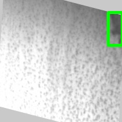
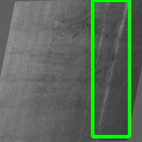

# Defect-Detection
Oil and surface defects detection

- [x] NEU_DET dataset
- [ ] oil dataset

The datasets will be used with augmented angles to imitate the view of quadcopter

**NEU_DET**
Samples of synthetically rotated images

 &nbsp;&nbsp;&nbsp;&nbsp; 


## Installation

For detailed procedure, please refer to [Installation](packages/installation.md)


## Training
```shell
python tools/train.py configs/detr/detr_101.py --work-dir work_dirs/detr --exp 1
```

## Testing
```shell
python tools/test.py configs/detr/detr_101.py  work_dirs/detr/ --work-dir work_dirs/detr/test_results
```

## Results Analysis


## Results
- [x] FasterRCNN
- [ ] DETR
- [ ] VitDet
- [ ] Mixture of FasterRCNN and VitDet on oil and surface defects

**Faster RCNN tested on augmented data**
| Augmentation  | Easy  (30%)  | Medium (60%)   |   Hard ( 90%)  | 
| ------------- | ------------ | -------------- |--------------- |
| Blue          |     0.616    |     0.435      |     0.331      | 
| Rotation      |     0.257    |     0.169      |     0.143      | 
| Brightness    |    0.641     |     0.568      |     0.5        | 
| All together  |    0.216     |     0.084      |     0.036      | 


**Faster RCNN trained on all augmentations, and tested on augmented data**

| Augmentation  | Easy  (30%)  | Medium (60%)   |   Hard ( 90%)  | 
| ------------- | ------------ | -------------- |--------------- |
| Blue          |    0.582     |     0.606      |     0.598      | 
| Rotation      |    0.241     |     0.162      |     0.146      | 
| Brightness    |    0.542     |     0.529      |     0.467      | 
| All together  |    0.264     |     0.202      |     0.146      | 


### Visualizers
Comming soon